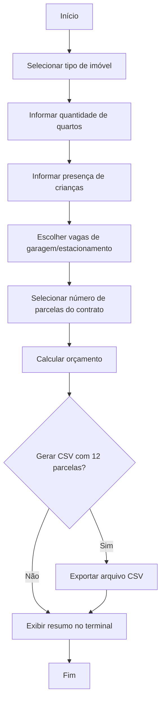

# Orçamento de Aluguel

Aplicação de linha de comando desenvolvida para a Imobiliária R.M. O sistema gera orçamentos mensais de aluguel para apartamentos, casas e estúdios seguindo todas as regras do desafio proposto.

## Pitch Rápido

Imagine acelerar o atendimento da locação em minutos: com o **Orçamento de Aluguel**, o corretor cadastra as preferências do cliente, o sistema calcula automaticamente o aluguel com adicionais e descontos e ainda gera o cronograma de 12 meses em CSV. É uma solução simples, objetiva e pronta para ser evoluída para web — ideal para a R.M automatizar orçamentos e encantar novos locatários.

## Visão Geral

- Interface de linha de comando guiada que coleta as preferências do cliente.
- Cálculo automático do aluguel mensal com adicionais, descontos e taxa de contrato.
- Parcelamento flexível do contrato imobiliário de R$ 2.000,00 em até 5 vezes.
- Geração opcional de arquivo CSV com as 12 parcelas (aluguel + contrato quando aplicável).
- Código totalmente orientado a objetos para facilitar manutenção e evolução.

## Regras de Negócio

| Tipo de imóvel | Valor base (1 quarto) | Acréscimo 2 quartos | Estacionamento/Garagem | Desconto |
| -------------- | --------------------- | ------------------- | ---------------------- | -------- |
| Apartamento    | R$ 700,00             | + R$ 200,00         | + R$ 300,00 por vaga   | -5% se não há crianças |
| Casa           | R$ 900,00             | + R$ 250,00         | + R$ 300,00 por vaga   | — |
| Estúdio        | R$ 1.200,00           | —                   | 2 vagas por R$ 250,00; vagas extras + R$ 60,00 cada | — |

Outras regras:

- Contrato imobiliário: R$ 2.000,00 parcelado em até 5 vezes.
- O resumo do orçamento apresenta: valor total do aluguel mensal, quantidade de parcelas do contrato, valor de cada parcela do contrato e total mensal durante o período parcelado.

## Fluxo da Aplicação



## Estrutura do Projeto

```
.
├── main.py                 # Ponto de entrada da aplicação (executa a CLI)
├── rental_quote/
│   ├── __init__.py
│   ├── calculator.py       # Lógica de cálculo de orçamentos
│   ├── cli.py              # Interface de linha de comando
│   ├── csv_exporter.py     # Exportação de parcelas para CSV
│   └── models.py           # Modelos e regras de negócio
├── tests/
│   └── test_calculator.py  # Testes unitários de cenários principais
└── README.md
```

## Como Executar

1. **Crie e ative um ambiente virtual (opcional, porém recomendado):**

   ```bash
   python -m venv .venv
   source .venv/bin/activate  # Linux/Mac
   .venv\\Scripts\\activate   # Windows
   ```

2. **Instale as dependências (não há bibliotecas externas obrigatórias, mas garanta Python 3.11+).**

3. **Execute o aplicativo:**

   ```bash
   python main.py
   ```

4. **Siga as instruções exibidas no terminal** para informar o tipo de imóvel, quantidade de quartos, existência de crianças, vagas, etc. Ao final a aplicação exibirá o resumo do orçamento e perguntará se você deseja gerar o CSV com as 12 parcelas.

## Exportação para CSV

Quando o usuário opta por gerar o arquivo, é criado um CSV (separador `;`) com as 12 competências mensais. Cada linha apresenta:

- `month`: mês (1 a 12)
- `rent`: valor do aluguel calculado para aquele imóvel
- `contract`: valor da parcela do contrato (0 quando o parcelamento terminou)
- `total`: soma de `rent` e `contract`

Exemplo (contrato parcelado em 4 vezes):

| month | rent  | contract | total |
| ----- | ----- | -------- | ----- |
| 1     | 900.0 | 500.0    | 1400.0 |
| 2     | 900.0 | 500.0    | 1400.0 |
| 3     | 900.0 | 500.0    | 1400.0 |
| 4     | 900.0 | 500.0    | 1400.0 |
| 5     | 900.0 | 0.0      | 900.0  |

O arquivo é salvo no diretório atual com o nome escolhido pelo usuário.

## Testes

O projeto inclui testes unitários para validar as principais regras de cálculo. Para executá-los:

```bash
python -m unittest discover -s tests
```

## Próximos Passos (Sugestões)

- Evoluir a CLI para uma interface web usando Flask, conforme uma das referências sugeridas.
- Integrar um banco de dados (SQLite, por exemplo) para armazenar clientes e orçamentos históricos.
- Adicionar autenticação de corretores e histórico de versões de orçamento.

## Referências

- [Python.org – Tutorial Oficial](https://www.python.org/doc/)
- [DevMedia – Guia Completo de Python](https://www.devmedia.com.br/curso/python)
- [LearnPython.org](https://learnpython.org/)
- [Google Developers – Python](https://developers.google.com/edu/python?hl=pt-br)
- [Aprendendo do Início com Daniel](https://www.youtube.com/@aprendendo.doinicio)
- [Udemy – Desenvolvimento web com Python e Flask](https://www.udemy.com/course/desenvolvimento-web-com-python-e-flask-j/?couponCode=KEEPLEARNINGBR)

